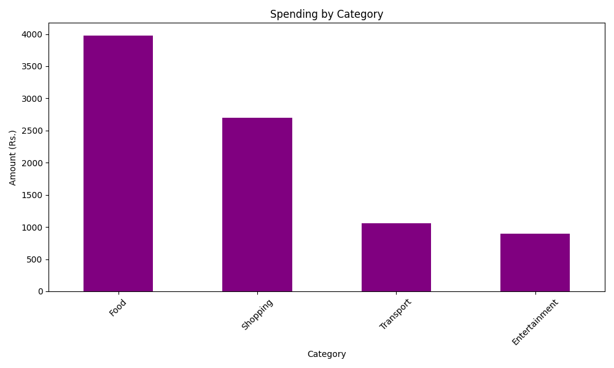
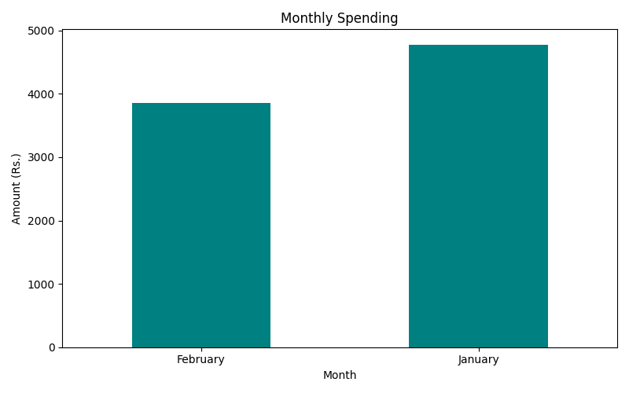

# Personal Finance Tracker

A Python tool to track, analyse and visualise personal expenses — built to understand where money actually goes, not where we think it goes.

---

## Overview

Most people have a rough idea of their spending. This project turns that rough idea into precise numbers.

Built as part of an ongoing data science learning journey, this tool reads expense data from a CSV file, computes spending patterns across categories and months, and visualises everything clearly using Python.

---

## What It Analyses

| Metric | Result |
|--------|--------|
| Total transactions | 24 |
| Total spent | Rs. 8,634 |
| Average per transaction | Rs. 359.75 |
| Highest single expense | Rs. 1,200 |
| Lowest single expense | Rs. 40 |
| Top spending category | Food — Rs. 3,975 |
| Highest spending month | January — Rs. 4,779 |

Food accounts for nearly half of all spending.
Shopping is the second largest category at Rs. 2,700.
Transport and Entertainment follow.

---

## Charts

### Spending by Category


### Monthly Spending


---

## How It Works

The tool reads a simple CSV file with four columns:

```
Date, Category, Description, Amount
```

You add your own expenses to the CSV and the tracker does the rest — no configuration needed.

---

## How to Run

```bash
# Clone the repository
git clone https://github.com/Paddu2006/personal-finance-tracker.git
cd personal-finance-tracker

# Install dependencies
pip install pandas matplotlib

# Add your expenses to expenses.csv
# Run the tracker
python tracker.py
```

---

## Project Structure

```
finance_tracker/
│
├── tracker.py          # Main analysis script
├── expenses.csv        # Expense data
├── category_spend.png  # Chart — spending by category
├── monthly_spend.png   # Chart — monthly spending
└── README.md
```

---

## Tech Stack

| Tool | Purpose |
|------|---------|
| Python 3.13 | Core language |
| Pandas | Data loading and analysis |
| Matplotlib | Visualisation |

---

## What I Learned Building This

- How to work with date data in Pandas using datetime conversion
- How groupby operations reveal spending patterns instantly
- How a simple four-column CSV can power meaningful personal insights
- That Food is always where the money goes

---

## Part of a Larger Journey

This is Project 3 of an ongoing series of data science projects.

Project 1 — AQI India Analyser: https://github.com/Paddu2006/aqi-india-analyser
Project 2 — Crop Yield Explorer: https://github.com/Paddu2006/crop-yield-explorer

---

## License

MIT License — free to use, share, and build upon.
